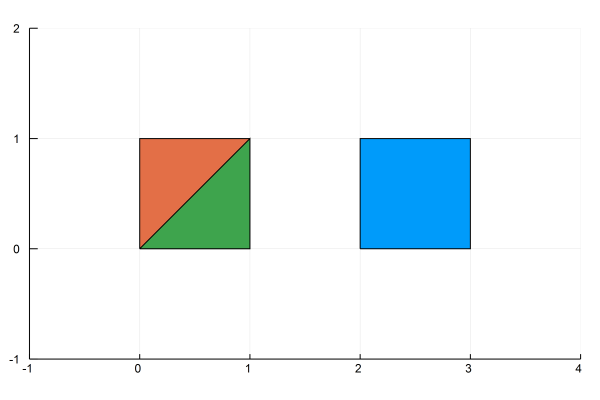
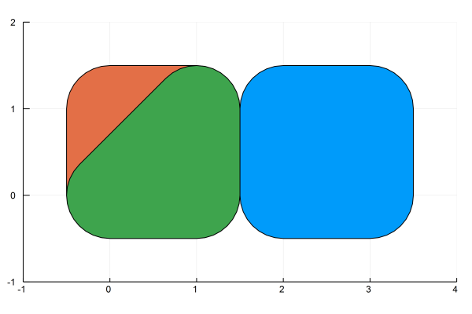
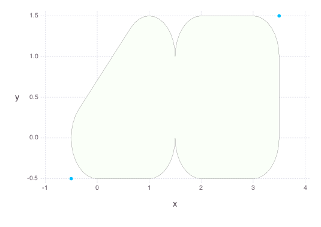

LibGEOS.jl
==========
[](https://travis-ci.org/JuliaGeo/LibGEOS.jl)
[](https://ci.appveyor.com/project/JuliaGeo/LibGEOS-jl/branch/master)
[](https://coveralls.io/github/JuliaGeo/LibGEOS.jl)

LibGEOS is a LGPL-licensed package for manipulation and analysis of planar geometric objects, based on the libraries [GEOS](https://trac.osgeo.org/geos/) (the engine of PostGIS) and JTS (from which GEOS is ported).

Among other things, it allows you to parse [Well-known Text (WKT)](https://en.wikipedia.org/wiki/Well-known_text)

```julia
p1 = readgeom("POLYGON((0 0,1 0,1 1,0 0))")
p2 = readgeom("POLYGON((0 0,1 0,1 1,0 1,0 0))")
p3 = readgeom("POLYGON((2 0,3 0,3 1,2 1,2 0))")
```


Add a buffer around them
```julia
g1 = buffer(p1, 0.5)
g2 = buffer(p2, 0.5)
g3 = buffer(p3, 0.5)
```


and take the union of different geometries
```julia
polygon = LibGEOS.union(g1, g3)
```


GEOS functionality is extensive, so coverage is incomplete, but the basic functionality for working with geospatial data is already available. I'm learning as I go along, so documentation is lacking, but if you're interested, you can have a look at the examples in the `examples/` folder, or the tests in `test/test_geo_interface.jl` and `test/test_geos_operations.jl`.

Installation
------------
1. At the Julia prompt, run 
  ```julia
  julia> Pkg.add("LibGEOS")
  ```
  This will install both the Julia package and GEOS shared libraries together. To just reinstall the GEOS shared libraries, run `Pkg.build("LibGEOS")`.

2. Test that `LibGEOS` works by runnning
  ```julia
  julia> Pkg.test("LibGEOS")
  ```
