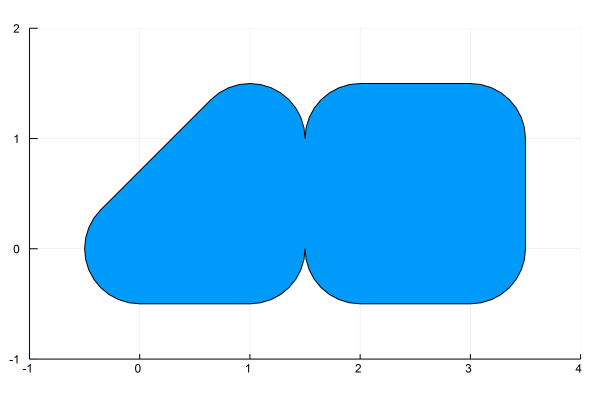

LibGEOS.jl
==========
[](https://github.com/JuliaGeo/LibGEOS.jl/actions?query=workflow%3ACI)
[](https://codecov.io/gh/JuliaGeo/LibGEOS.jl)

LibGEOS is a package for manipulation and analysis of planar geometric objects, based on the
libraries [GEOS](https://libgeos.org/) (the engine of PostGIS) and JTS (from which GEOS is
ported). This package wraps the GEOS C API, see its
[usage](https://libgeos.org/usage/c_api/) and
[reference](http://libgeos.org/doxygen/geos__c_8h.html) docs.

Among other things, it allows you to parse [Well-known Text (WKT)](https://en.wikipedia.org/wiki/Well-known_text).

```julia
p1 = readgeom("POLYGON((0 0,1 0,1 1,0 0))")
p2 = readgeom("POLYGON((0 0,1 0,1 1,0 1,0 0))")
p3 = readgeom("POLYGON((2 0,3 0,3 1,2 1,2 0))")
```


Add a buffer around them
```julia
g1 = buffer(p1, 0.5)
g2 = buffer(p2, 0.5)
g3 = buffer(p3, 0.5)
```


and take the union of different geometries
```julia
polygon = LibGEOS.union(g1, g3)
```


GEOS functionality is extensive, so coverage is incomplete, but the basic functionality for working with geospatial data is already available. I'm learning as I go along, so documentation is lacking, but if you're interested, you can have a look at the examples in the `examples/` folder, or the tests in `test/test_geo_interface.jl` and `test/test_geos_operations.jl`.


Conversion to/from GeoInterface objects
---------------------------------------

[GeoInterface.jl](https://github.com/JuliaGeo/GeoInterface.jl) compatible geometries from many 
packages including GeometryBasics.jl, Shapefile.jl, GeoJSON.jl, KML.jl, ArchGDAL.jl, GADM.jl 
and others can be easily converted to LibGEOS geometries using:

```
GeoInterface.convert(LibGEOS, other_package_geometry)
```

To broadcast this over a vector or iterable we need to use `Ref` on `LibGEOS`:

```
GeoInterface.convert.(Ref(LibGEOS), iterable_of_geometries)
```

The same applies in reverse, such as for interop with the Makie.jl/GeometryBasics.jl ecosystem:
 
```
GeoInterface.convert(GeometryBasics, libgeos_geometry)
```

For packages like Shapefile.jl and GeoJSON.jl, converting to their objects isn't 
possible, as theyre not particularly useful on their own. Instead, we can just write directly:

```
Shapefile.write("myfile.shp", libgeos_geometry)
```

GeoInterface methods
-----------------------

GeoInterace.jl OGC standards methods work on LibGEOS objects:

- `GeoInterface.distance`
- `GeoInterface.buffer`
- `GeoInterface.convexhull`
- `GeoInterface.equals`
- `GeoInterface.disjoint`
- `GeoInterface.intersects`
- `GeoInterface.touches`
- `GeoInterface.within`
- `GeoInterface.contains`
- `GeoInterface.overlaps`
- `GeoInterface.crosses`
- `GeoInterface.symdifference`
- `GeoInterface.difference`
- `GeoInterface.intersection`
- `GeoInterface.union`

See the GeoInterface.jl [API docs](https://juliageo.org/GeoInterface.jl/stable/reference/api/) for details.

Exported LibGEOS geometries:
--------------------

- `GeometryCollection`
- `LineString`
- `LinearRing`
- `MultiLineString`
- `MultiPoint`
- `MultiPolygon`
- `Point`
- `Polygon`
- `STRtree`

Exported LibGEOS functions:
-------------------

- `area`
- `boundary`
- `buffer`
- `bufferWithStyle`
- `centroid`
- `constrainedDelaunayTriangulation`
- `containsproperly`
- `convexhull`
- `coveredby`
- `covers`
- `crosses`
- `delaunayTriangulation`
- `delaunayTriangulationEdges`
- `difference`
- `disjoint`
- `distance`
- `endPoint`
- `envelope`
- `equals`
- `equalsexact`
- `exteriorRing`
- `geomLength`
- `getGeometries`
- `getGeometry`
- `getPrecision`
- `getXMax`
- `getXMin`
- `getYMax`
- `getYMin`
- `hasZ`
- `hausdorffdistance`
- `interiorRing`
- `interiorRings`
- `interpolate`
- `interpolateNormalized`
- `intersection`
- `intersects`
- `isClosed`
- `isEmpty`
- `isRing`
- `isSimple`
- `isValid`
- `lineMerge`
- `minimumRotatedRectangle`
- `nearestPoints`
- `node`
- `numGeometries`
- `numPoints`
- `overlaps`
- `pointOnSurface`
- `polygonize`
- `prepareGeom`
- `project`
- `projectNormalized`
- `query`
- `readgeom`
- `setPrecision`
- `sharedPaths`
- `simplify`
- `snap`
- `startPoint`
- `symmetricDifference`
- `topologyPreserveSimplify`
- `touches`
- `unaryUnion`
- `union`
- `uniquePoints`
- `within`
- `writegeom`

Installation
------------
1. At the Julia prompt, run 
  ```julia
  pkg> add LibGEOS
  ```
  This will install both the Julia package and GEOS shared libraries together. The GEOS build comes from [GEOS_jll](https://github.com/JuliaBinaryWrappers/GEOS_jll.jl/releases), and the build script can be found in [Yggdrasil](https://github.com/JuliaPackaging/Yggdrasil/tree/master/G/GEOS).

2. Test that `LibGEOS` works by runnning
  ```julia
  pkg> test LibGEOS
  ```
  
  # Ecosystem
  * All [GeoInterface.jl](https://github.com/JuliaGeo/GeoInterface.jl) compatible geometries will work in LibGEOS without conversion.
  * Makie support for LibGEOS is available via [LibGEOSMakie.jl](https://github.com/jw3126/LibGEOSMakie.jl)
  * LibGEOS integrates with [GeoInterface.jl](https://github.com/JuliaGeo/GeoInterface.jl) making it easy to combine LibGEOS with other geometry packages.
  
